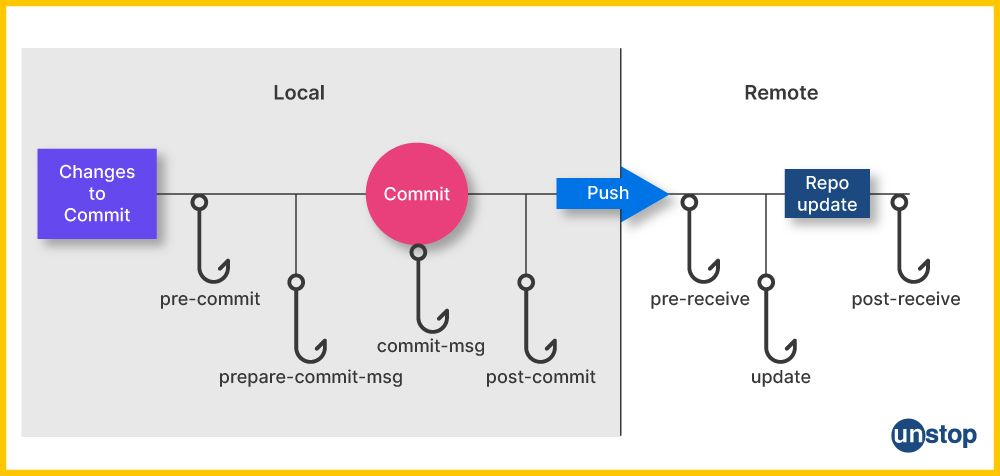

# pre-commit, un framework pas que reservé aux développeurs !

Et si nous mettions encore plus de linters dans notre Infrastructure as Code ?

<div class="abs-br m-6 flex gap-2">
  <a href="https://github.com/christopherlouet/meetup-precommit" target="_blank" alt="GitHub" title="Meetup pre-commit"
    class="text-xl slidev-icon-btn opacity-50 !border-none !hover:text-white">
    <carbon-logo-github />
  </a>
</div>

<style>
h1 {
  background-color: #FFF;
  background-image: none;
}
p {
  color: #FFF;
  font-weight: bold;
  opacity: 0.7;
}
.slidev-layout h1 + p {
  opacity: 0.8;
}
</style>

---
transition: slide-left
hideInToc: true
---

# Sommaire

<Toc minDepth="1" maxDepth="1"></Toc>

---
transition: slide-left
---

# Hooks git et cycle de vie des commits

<br />

Un hook git va permettre de :

* Détecter des erreurs ou problèmes de syntaxe (linting)
* Reformater automatiquement le code (formating)
* Réaliser des tests unitaires automatiquement
* Identifier les secrets avant qu'ils ne se retrouvent dans les commits
* Définir ses propres actions à exécuter avant le commit

[//]: # (* améliorer la qualité du code)
[//]: # (* respecter les conventions de mise en forme)

---
transition: slide-left
---

<p align="center" width="100%">
    
</p>

---
transition: slide-left
---

## Démonstration sur un nouveau projet git

* Présentation des hooks
* Initialisation de pre-commit en erreur
* Test de la branche courante

<br />

```bash
cat .git/hooks/pre-commit
```

```bash
#!/usr/bin/env bash

git_branch=$(git branch --show-current)

if [[ "$git_branch" == "main" ]] || [[ "$git_branch" == "master" ]]; then
    message="Impossible de commit sur $git_branch"
    echo -e "\033[0;31m$message\033[0;0m"
    exit 1
else
    exit 0
fi
```

---
transition: slide-left
---

# pre-commit, quèsaco ?

<br />

Un framework pour gérer des hooks de pre-commit, pour différents languages.

* Centralisation des hooks de pre-commit dans un fichier de configuration
* Catalogue de hooks proposé par la communauté
* Version 1.0.0 introduite en septembre 2017
* En janvier 2025 : version 4.1.0

<br >

Démonstration

* Installation  de pre-commit
* Configuration de pre-commit dans le projet git
* Exécution de pre-commit

---
transition: slide-left
---

# Présentation des hooks et de son catalogue de scripts

<br>

https://pre-commit.com/hooks.html
https://github.com/pre-commit/pre-commit-hooks

## Linters

Détecter les erreurs de syntaxe et validation du code

* check-added-large-files
* check-yaml
* check-toml
* check-executables-have-shebangs
* check-shebang-scripts-are-executable

---
transition: slide-left
---

## Formatters

Corriger automatiquement les fichiers.

* end-of-file-fixer
* trailing-whitespace

## Git

Vérifier si des conflits de merge sont présents

* check-merge-conflict

Github actions

* rhysd/actionlint

---
transition: slide-left
---


## Documentation

Analyser la syntaxe des fichiers markdown

* markdownlint/markdownlint:

## Langage python

Ruff : Linter et formatter Python, écrit en rust

* astral-sh/ruff-pre-commit

## Scripts bash

Shellcheck : l'outil d'analyse pour les scripts bash

* shellcheck-py/shellcheck-py

---
transition: slide-left
---

## Gitleaks

<br >

* Identifier les mots de passe, tokens, clés API, certificats
* Générer un rapport au format json, pour lister tous les secrets
* Possibilité de personnaliser finement la détection des secrets
* Ignorer des fichiers ou des secrets spécifiques
* https://github.com/gitleaks/gitleaks

<br />

```bash
➜  ~/code(master) gitleaks git -v

Finding:     "export BUNDLE_ENTERPRISE__CONTRIBSYS__COM=cafebabe:deadbeef",
Secret:      cafebabe:deadbeef
RuleID:      sidekiq-secret
Entropy:     2.609850
File:        cmd/generate/config/rules/sidekiq.go
Line:        23
Commit:      cd5226711335c68be1e720b318b7bc3135a30eb2
Author:      John
Email:       john@users.noreply.github.com
Date:        2022-08-03T12:31:40Z
Fingerprint: cd5226711335c68be1e720b318b7bc3135a30eb2:cmd/generate/config/rules/sidekiq.go:sidekiq-secret:23
```

---
transition: slide-left
---

# Framework pre-commit dans un contexte DevOps

## Projets Ansible

Linter Ansible et ansible-lint

Fichier de configuration .ansible-lint

```bash
---
profile: production

# exclude_paths included in this file are parsed relative to this file's location and not relative to the CWD of execution.
exclude_paths:
- .cache/

# Ansible-lint does not fail on warnings from the rules or tags listed below
warn_list:
- command-instead-of-module
- command-instead-of-shell

# Ansible-lint will skip and ignore the rules or tags listed below
skip_list:
  - yaml
```

---
transition: slide-left
---

Configuration pre-commit

```bash
repos:
  - repo: https://github.com/ansible/ansible-lint.git
    rev: v25.1.3
    hooks:
      - id: ansible-lint
        files: \.(yaml|yml)$
        name: Ansible Lint
        description: Run configurations on .ansible-lint file
        verbose: true
        # args: [-p, ./ansible/*]
```

---
transition: slide-left
---

## Projets Terraform

<br />

Exemple de hooks disponibles avec les repositories **antonbabenko/pre-commit-terraform** et **terraform-docs**

* terraform fmt : formater les fichiers de configuration avec une convention de nommage recommandée
* terraform validate : vérifier la configuration terraform au format HCL
* tflint : vérifier si il existe des erreurs
* tfsec : identifier des failles de sécurité dans la configuration terraform
* terraform_docs : générer des fichiers README

---
transition: slide-left
---

Configuration pre-commit

```bash
repos:
- repo: https://github.com/terraform-docs/terraform-docs
  rev: "v0.19.0"
  hooks:
    - id: terraform-docs-go
      args: ["markdown", "table", "--output-file", "README.md", "./"]
- repo: https://github.com/antonbabenko/pre-commit-terraform
  rev: "v1.97.4"
  hooks:
    - id: terraform_fmt
    - id: terraform_tflint
    - id: terraform_validate
    - id: terraform_tfsec
```

---
transition: slide-left
---

## pre-commit dans des pipelines ?

<br />

Avantages

* Utiliser la même configuration pre-commit qu'en local
* Simplifier la maintenance

Inconvénients

* Gestion des rapports au format attendu
* Utiliser une configuration spécifique pour les pipelines
* Migrer la CI existante

---
transition: slide-left
---

[//]: # ()
[//]: # (# Demo projet terraform)

[//]: # ()
[//]: # (* Présentation de la configuration)

[//]: # (* Demo en live)

[//]: # ()
[//]: # ([//]: # &#40;todo&#41;)
[//]: # ()
[//]: # (---)

[//]: # (transition: slide-left)

[//]: # (---)

[//]: # ()
[//]: # (# Demo projet ansible)

[//]: # ()
[//]: # (* Présentation de la configuration)

[//]: # (* Demo en live)

[//]: # ()
[//]: # ([//]: # &#40;todo&#41;)
[//]: # ()
[//]: # (---)

[//]: # (transition: slide-left)

[//]: # (---)

[//]: # ()
[//]: # (# Et si nous utilisions pre-commit dans nos pipelines CI ?)

[//]: # ()
[//]: # (* Github actions)

[//]: # (* Gitlab components)

[//]: # (* Demo)

[//]: # ()
[//]: # ([//]: # &#40;todo&#41;)
[//]: # ()
[//]: # (---)

[//]: # (transition: slide-left)

[//]: # (---)

# Conclusion

* Avantages à l'intégrer dès la mise en place d'un nouveau projet
* Élargir au fil de l'eau sur un projet existant
* Permet de mettre en place des linters et formatters simplement
